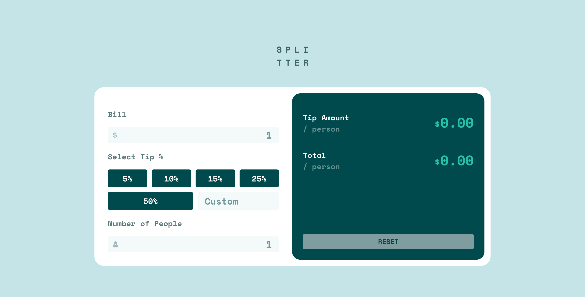

# Frontend Mentor - Tip calculator app solution

This is a solution to the [Tip calculator app challenge on Frontend Mentor](https://www.frontendmentor.io/challenges/tip-calculator-app-ugJNGbJUX). 

## Table of contents

- [Overview](#overview)
  - [The challenge](#the-challenge)
  - [Screenshot](#screenshot)
  - [Links](#links)
- [My process](#my-process)
  - [Built with](#built-with)
  - [What I learned](#what-i-learned)

## Overview

### The challenge

Users should be able to:

- View the optimal layout for the app depending on their device's screen size
- See hover states for all interactive elements on the page
- Calculate the correct tip and total cost of the bill per person

### Screenshot

This is screenshot of my solution to this challenge. 

### Links

- Solution URL: [Add solution URL here](https://github.com/espinoza0/tip-calculator-app-main)
- Live Site URL: [Add live site URL here](https://espinoza0.github.io/tip-calculator-app-main/)

## My process

### Built with

- Semantic HTML5 markup
- CSS custom properties
- Flexbox
- JavaScript

### What I learned

This is my very first HTML CSS and JavaScript project that I publish. Even though it's a basic implementation, I learned more about DOM manipulation, Event Listeners, For Each loop, Control of errors and Arithmetic Operations. Looking forward to the next challenge!
